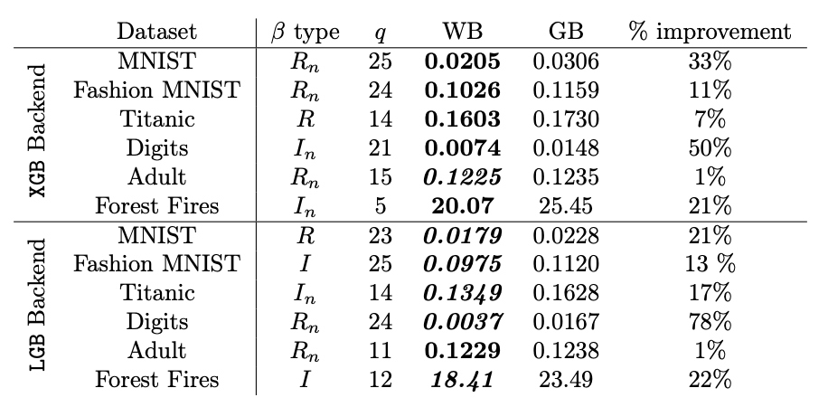

Overview
========

## Introduction

Consider the usual Gradient Boosting (GB) problem. Given an input $X$, GB attempts to relate $X$ to a desired output, $Y$, through a loss function, $L$. Specifically, GB finds a function, $F$, attempting to minimize:
$$
    L(Y,F(X)).
$$

Wide Boosting (WB) solves a very similar problem.  If $F(X) \in \mathbb{R}^{1 \times q}$ and we consider a matrix, $\beta \in \mathbb{R}^{q \times d}$, then WB finds $F$ by attempting to minimize:
$$
    L(Y,F(X)\beta).
$$
The $\beta$ matrix is multiplied to the output, $F(X)$, exactly like you would find in a regression setup. The type of $\beta$ matrix we use can be set as a parameter in `wideboost` as described in [Wideboost-specific Parameters](wideboost_parameters.md)

## Why multiply $F$ by a matrix?

The $\beta$ multiplication allows $F(X)$ to have a large (or small) dimension before it is compared to the output, $Y$.  Analogously, a neural network with a "wide" hidden layer can have a much larger dimension than it's final output layer. In fact, Wide Boosting can be thought of as putting the usual GB function, $F$, as the first layer in a wide, one-hidden-layer neural network.

Just as a wide, one-hidden-layer neural network can outperform a narrow, one-hidden-layer neural network, a wide $F$, fit via Wide Boosting, can outperform the more narrow $F$ that gets fit in a standard GB setup. Empirical performance on a handful of publicly available datasets is shown below. As you can see WB outperforms GB, as implemented in either XGBoost or LightGBM, on every dataset in this table.

## Implementation

Given the simplicity of Wide Boosting, we are able to use world-leading GB packages such as `XGBoost` and `LightGBM` to fit WB models by simply providing those packages with the correct gradient and hessian calculations.  If $G$ and $H$ are the gradients and hessians for $F$ in $L(Y,F(X))$, then, the gradients and hessians for $F$ in $L(Y,F(X)\beta)$ are simply $G \beta^T$ and $\beta H \beta^T$. `wideboost` uses these formulas to provide both backend GB packages with gradient and hessian information so that we can find $F$ using the powerful boosting implementations found in both `XGBoost` and `LightGBM`.